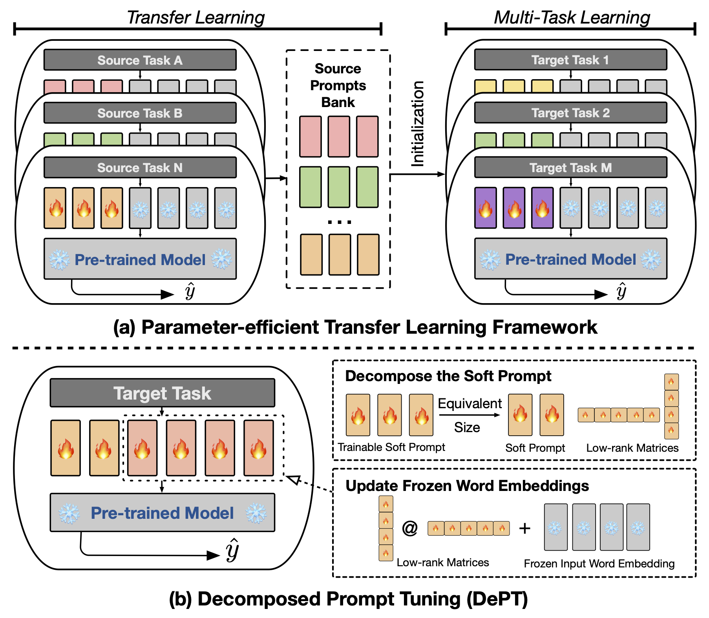

# DePT: Decomposed Prompt Tuning for Parameter-Efficient Fine-tuning
This repository provides the code for the paper titled **[DePT: Decomposed Prompt Tuning for Parameter-Efficient Fine-tuning](https://arxiv.org/abs/2309.05173)**, making the integration of our code contributions into other projects more accessible.

<div align="center">

  [](https://arxiv.org/abs/2309.05173)
  [](https://pytorch.org/)
  [](https://opensource.org/licenses/MIT)
</div>

<p align="center">
  </a>
  <br />
</p>

- **<span style="color:red;">[:loudspeaker: News - 26 Sep 2023]</span>** We now support Llama-2 Models. Please set `MODEL` to your local Llama-2 path to run the experiments.
- **<span style="color:red;">[:loudspeaker: News - 21 Sep 2023]</span>** Check out our work at NeurIPS 2023 titled **[Don’t Stop Pretraining? Make Prompt-based Fine-tuning Powerful Learner](https://arxiv.org/abs/2305.01711)** and the code at **[PowerfulPromptFT](https://github.com/ZhengxiangShi/PowerfulPromptFT)**.

## Quick Links#
- [DePT: Decomposed Prompt Tuning for Parameter-Efficient Fine-tuning](#dept-decomposed-prompt-tuning-for-parameter-efficient-fine-tuning)
  - [Quick Links#](#quick-links)
  - [Overview](#overview)
  - [1. Requirements and Installation](#1-requirements-and-installation)
  - [2. Prepare the datasets](#2-prepare-the-datasets)
  - [3. Run Experiments](#3-run-experiments)
  - [Limitations](#limitations)
  - [Bugs or questions?](#bugs-or-questions)
  - [Citation](#citation)
  - [Acknowledgement](#acknowledgement)


## Overview
You can reproduce the experiments of our paper [DePT: Decomposed Prompt Tuning for Parameter-Efficient Fine-tuning](https://arxiv.org/abs/2309.05173).

> **Abstract**
> Prompt tuning (PT), where a small amount of trainable soft (continuous) prompt vectors is affixed to the input of language models (LM), has shown promising results across various tasks and models for parameter-efficient fine-tuning (PEFT). PT stands out from other PEFT approaches because it maintains competitive performance with fewer trainable parameters and does not drastically scale up its parameters as the model size expands. However, PT introduces additional soft prompt tokens, leading to longer input sequences, which significantly impacts training and inference time and memory usage due to the Transformer's quadratic complexity. Particularly concerning for Large Language Models (LLMs) that face heavy daily querying. To address this issue, we propose Decomposed Prompt Tuning (DePT), which decomposes the soft prompt into a shorter soft prompt and a pair of low-rank matrices that are then optimised with two different learning rates. This allows DePT to achieve better performance while saving over 20% memory and time costs compared to vanilla PT and its variants, without changing trainable parameter sizes. Through extensive experiments on 23 natural language processing (NLP) and vision-language (VL) tasks, we demonstrate that DePT outperforms state-of-the-art PEFT approaches, including the full fine-tuning baseline in some scenarios. Additionally, we empirically show that DEPT grows more efficient as the model size increases. Our further study reveals that DePT integrates seamlessly with parameter-efficient transfer learning in the few-shot learning setting and highlights its adaptability to various model architectures and sizes.

## 1. Requirements and Installation
To run the prompt-based or cls-based fine-tuning, you need to install the following packages.
- Transformers
- Pytorch

## 2. Prepare the datasets
We use the following NLP datasets in our experiments: [GLUE](https://huggingface.co/datasets/glue), [SuperGLUE](https://huggingface.co/datasets/super_glue), [MRQA 2019 Shared Task](https://huggingface.co/lucadiliello), [WinoGrande](https://huggingface.co/datasets/winogrande), [Yelp-2](https://huggingface.co/datasets/yelp_polarity), [SciTail](https://huggingface.co/datasets/scitail/viewer/snli_format/train) and [PAWS-Wiki](https://huggingface.co/datasets/paws). All these datasets are available in the [Huggingface Datasets](https://huggingface.co/datasets) and can be downloaded automatically. Please refer to the file `src/tasks.py` for the details of the datasets. 

## 3. Run Experiments
We provide the scripts to reproduce the main experiments in our paper.
For example, you can run the following script to reproduce the results of DePT on the GLUE dataset. The `PREFIX_LENGTH` represents the length of the soft prompt `m` in the paper. The `R` represents the rank of low-rank matrices `r` in the paper. `lr` is the learning rate for the the soft prompt, and `LORA_LR` is the learning rate for the the pair of the low-rank matrices that will be added to the frozen word embeddings.
```sh
MODEL=t5-base
MAX_LENGTH=256
MAX_STEPS=40000
PREFIX_LENGTH=40 
R=45
for TASK_NAME in cola mrpc mnli qnli qqp rte sst2 stsb; do
  for LORA_LR in 5e-3 3e-1 5e-4; do
      for lr in 3e-1 4e-1; do
            CUDA_VISIBLE_DEVICES=0 python train.py \
                --peft_type PROMPT_TUNING_LORA \
                --lora_embedding_lr ${LORA_LR} \
                --learning_rate ${lr} \
                --prefix_length ${PREFIX_LENGTH} \
                --r ${R} \
                --task_name ${TASK_NAME} \
                --dataset_config_name en \
                --model_name_or_path ${MODEL} \
                --do_train \
                --do_eval \
                --do_predict \
                --per_device_train_batch_size 32 \
                --per_device_eval_batch_size 32 \
                --max_seq_length ${MAX_LENGTH} \
                --save_strategy steps \
                --evaluation_strategy steps \
                --max_steps ${MAX_STEPS} \
                --eval_steps 1000 \
                --save_steps 1000 \
                --warmup_steps 500 \
                --weight_decay 1e-5 \
                --load_best_model_at_end \
                --save_total_limit 1 \
                --output_dir saved_${MODEL}/${TASK_NAME}_lr${lr}_loralr${LORA_LR}_pl${PREFIX_LENGTH}_r${R}_st${MAX_STEPS};
        done;
    done;
done
```
You can replace the `TASK_NAME` with `superglue-multirc superglue-wic superglue-wsc.fixed superglue-cb superglue-boolq` for the SuperGLUE benchmark, `newsqa searchqa hotpotqa nq` for the MRQA 2019 Shared Task, `winogrande` for the WinoGrande dataset, `yelp_polarity` for the Yelp-2 dataset, `scitail` for the SciTail dataset, and `paws` for the PAWS-Wiki dataset. 

Additionally, you can add the argument `--peft_model_id` to initialize the soft prompt and the pair of low-rank matrices with the pretrained prompt vectors. You can add the argument `--k_shot_examples` to specify the number of examples used for the few-shot learning.

## Limitations
As we dicussed in the paper, one of the potential limitations of this work is the introduction of extra hyperparameters for tuning, *e.g.*, the learning rate of the low-rank matrices and training steps. This might introduce some additional computational overhead during the hyperparameter optimization phase of model training. It is important to search over all these hyperparameters to get the optimal performance. For the large dataset with more than 100,000 training example, we follow the prior work ([Vu et al., 2022](https://aclanthology.org/2022.acl-long.346/)) to train our proposed method DePT with up to 300,000 steps. Training more steps is helpful for improving the performance on the large datasets. Using parameter-efficient transfer learning can be helpful to reduce these efforts. However, it is important to note that the model training process is a one-time event, while the model inference is not. In this context, the efficiency benefits of DePT become especially valuable. 

## Bugs or questions?
If you have any questions regarding the code or the paper, please feel free to reach out to Zhengxiang at `zhengxiang.shi.19@ucl.ac.uk`.  If you experience any difficulties while using the code or need to report a bug, feel free to open an issue. We kindly ask that you provide detailed information about the problem to help us provide effective support.

## Citation
```
@article{shi2023dept,
title = {DePT: Decomposed Prompt Tuning for Parameter-Efficient Fine-tuning},
author = {Shi, Zhengxiang and Lipani, Aldo},
journal = {ArXiv},
url = {http://arxiv.org/abs/2309.05173},
year = {2023},
}
```

## Acknowledgement
This repository is built upon the following repositories:
- [PowerfulPromptFT](https://github.com/ZhengxiangShi/PowerfulPromptFT)
- [pretraining-or-self-training](https://github.com/amzn/pretraining-or-self-training)
- [Huggingface Transformers](https://github.com/huggingface/transformers)
- [Huggingface PEFT](https://github.com/huggingface/peft)
